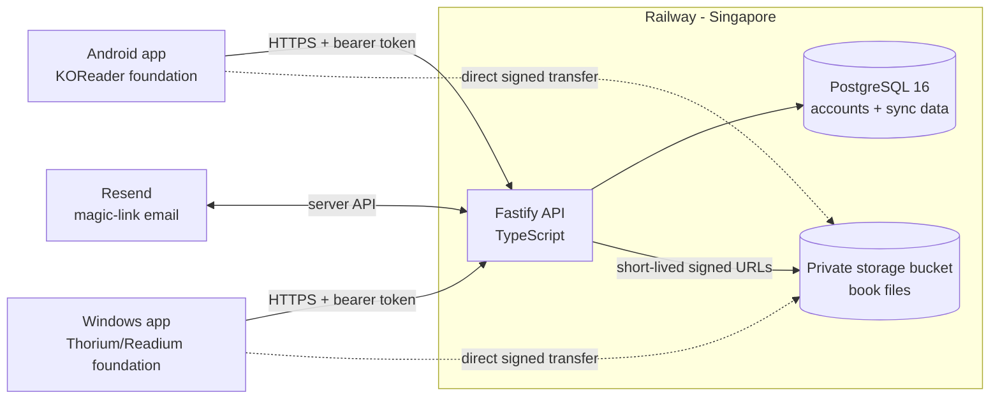

# Simple Cloud Reader

A cross-device ebook reader designed around a quiet, ReadEra-inspired library,
reliable offline reading, and automatic cloud synchronization.

> **Current status:** The TypeScript synchronization backend is live on
> Railway. The Windows and Android reader applications are under active
> development.

[](https://github.com/Jcee-bin/simple-cloud-reader/actions/workflows/phase-0.yml)
[](https://simple-cloud-reader-production.up.railway.app/health/ready)
[](https://simple-cloud-reader-production.up.railway.app/openapi.json)

## Why This Project

Powerful reading engines often expose file browsers, plugins, and specialist
settings before the book itself. Simple Cloud Reader takes the opposite
approach: open into a visual library, tap a cover, and continue reading.

The product combines:

- **KOReader** for Android document rendering.
- **Thorium/Readium Desktop** for the Windows reader.
- A shared **offline-first synchronization protocol**.
- A live **Railway backend** for accounts, metadata, and private book storage.

It is one product delivered through an Android app for phones/tablets and a
Windows desktop app. It is not a copy of ReadEra source code or assets.

## What Works Today

The deployed backend currently provides:

- Passwordless magic-link authentication.
- Short-lived access tokens and rotating refresh tokens.
- Registered device identity for Android and Windows.
- Private signed book uploads and downloads.
- User-scoped SHA-256 file deduplication.
- Incremental push/pull synchronization.
- Idempotent mutation retries.
- Reading progress, highlights, notes, bookmarks, and collections.
- Conflict recovery for simultaneous note edits.
- Protection against suspicious backward progress jumps.
- Tombstones that prevent stale offline resurrection.
- Per-user storage quotas and endpoint rate limits.
- Account and owned-object deletion.
- Health checks, redacted logs, migrations, and maintenance jobs.

Live readiness:

```text
GET https://simple-cloud-reader-production.up.railway.app/health/ready
```

```json
{
  "status": "ready",
  "components": {
    "database": "ready",
    "objectStore": "ready"
  }
}
```

## Architecture



The API is the authoritative merge point. Each client will retain a local
database and mutation queue, allowing reading and annotation while offline.
When connectivity returns, clients push stable operations and pull ordered
changes using a signed cursor.

Read the full explanation in [docs/BACKEND.md](docs/BACKEND.md) and the
database/request diagrams in
[docs/architecture/backend-schema.md](docs/architecture/backend-schema.md).

## Technology

| Area                  | Technology                                            |
| --------------------- | ----------------------------------------------------- |
| API runtime           | Node.js, TypeScript, Fastify                          |
| Database              | PostgreSQL 16, Drizzle ORM                            |
| Validation and schema | Zod, generated OpenAPI 3.1                            |
| Authentication        | Magic links, JOSE JWT, rotating opaque refresh tokens |
| Object storage        | Railway S3-compatible Storage Bucket, AWS SDK         |
| Infrastructure        | Railway, GitHub Actions                               |
| Testing               | Vitest, PostgreSQL integration tests                  |
| Android foundation    | KOReader                                              |
| Windows foundation    | Thorium Reader / Readium Desktop                      |

## Repository Map

```text
apps/android/           KOReader-derived Android foundation
apps/windows/           Thorium/Readium Windows foundation
services/api/           Fastify API, PostgreSQL repositories, sync engine
packages/sync-contract/ Shared Zod models and generated OpenAPI document
packages/design-tokens/ Platform-neutral visual tokens
infra/railway/          Railway configuration and operations guide
docs/                   Architecture, backend, roadmap, and evidence
```

## Run the Backend Locally

Requirements:

- Node.js 22+
- npm 11+
- PostgreSQL 16
- An S3-compatible object store
- A Resend API key or compatible email sender configuration

```powershell
git clone https://github.com/Jcee-bin/simple-cloud-reader.git
cd simple-cloud-reader
git switch phase-0-technical-foundation
npm ci
Copy-Item services/api/.env.example services/api/.env
```

Fill the local environment values, then:

```powershell
npm run build --workspace=@simple-cloud-reader/sync-contract
npm run db:migrate --workspace=@simple-cloud-reader/api
npm run build --workspace=@simple-cloud-reader/api
node services/api/dist/src/server.js
```

Machine-readable API schema:

```text
packages/sync-contract/openapi/simple-cloud-reader-v1.json
```

Human-readable endpoint guide: [docs/API.md](docs/API.md).

## Verify

```powershell
npm run test --workspace=@simple-cloud-reader/sync-contract
npm run typecheck --workspace=@simple-cloud-reader/sync-contract
npm run build --workspace=@simple-cloud-reader/sync-contract

npm run test --workspace=@simple-cloud-reader/api
npm run typecheck --workspace=@simple-cloud-reader/api
npm run build --workspace=@simple-cloud-reader/api
npm run db:check --workspace=@simple-cloud-reader/api
```

GitHub Actions runs the PostgreSQL-only integration and end-to-end tests using
a PostgreSQL 16 service. The latest backend hardening run is
[27470211525](https://github.com/Jcee-bin/simple-cloud-reader/actions/runs/27470211525).

## Engineering Highlights

- Transactional mutation receipts make network retries safe without applying
  the same change twice.
- Signed cursors are scoped to one user, preventing forged or cross-account
  change positions.
- Entity-level PostgreSQL locks serialize concurrent device writes.
- Same-note last-write-wins keeps the overwritten note in recovery history.
- Deletion tombstones stop an offline device from recreating deleted content.
- Book bytes transfer directly between clients and private storage through
  short-lived signed URLs, keeping large files away from the API process.
- A PostgreSQL advisory lock makes per-user quota checks safe under concurrent
  uploads.

Resume and interview material is collected in
[docs/PORTFOLIO.md](docs/PORTFOLIO.md).

## Roadmap

1. Complete the Windows vertical slice and Quiet Bookshelf UI.
2. Import EPUBs into managed local storage.
3. Connect Windows authentication, file transfer, progress, and highlights.
4. Produce an unsigned Windows test installer.
5. Build the Android phone/tablet vertical slice on KOReader.
6. Complete shared UI, offline recovery, accessibility, and release packaging.

See [NEXT_STEPS.md](NEXT_STEPS.md) and the
[delivery roadmap](docs/superpowers/plans/2026-06-12-simple-cloud-reader-roadmap.md).

## Security and Privacy

- Clients never receive permanent bucket credentials.
- Tokens and signed URLs are redacted from production logs.
- Every protected query and object key is scoped to the authenticated user.
- Cross-user file deduplication is intentionally prohibited.
- Secrets belong in Railway variables or ignored local environment files.

Please report vulnerabilities through [SECURITY.md](SECURITY.md), not a public
issue.

## Contributing and Licensing

Read [CONTRIBUTING.md](CONTRIBUTING.md) before opening a pull request.

This is a mixed-license monorepo:

- The Android KOReader derivative carries AGPL-3.0 obligations.
- The Windows Thorium-derived code preserves BSD-3-Clause attribution.
- Original project code requires an explicit root license decision before
  broad redistribution or external contribution.

See [LICENSES.md](LICENSES.md) and [UPSTREAMS.md](UPSTREAMS.md).
