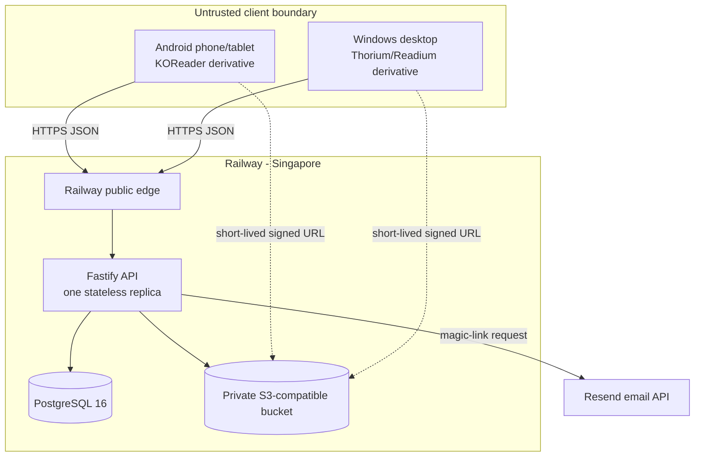
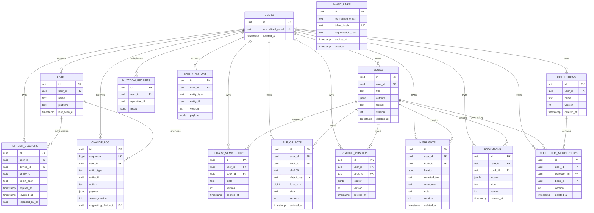
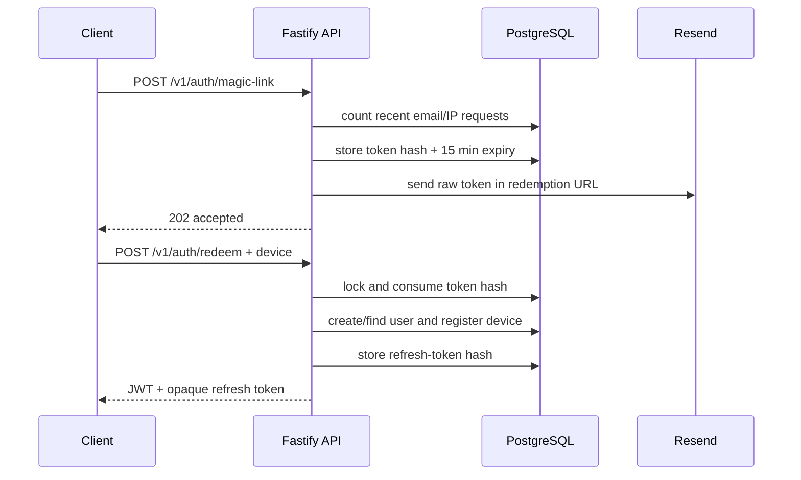
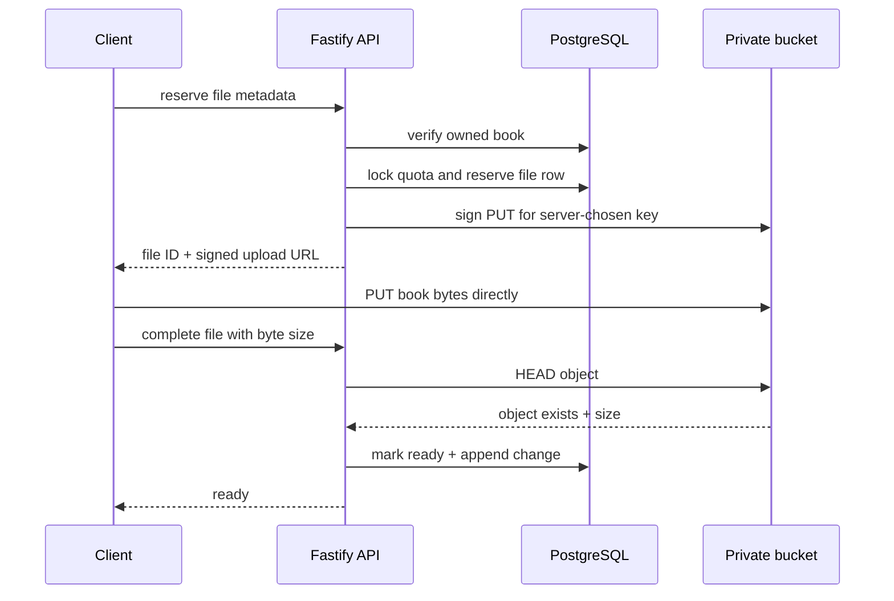
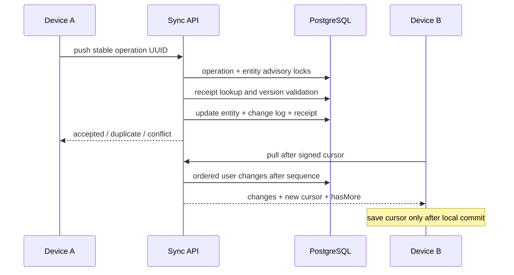
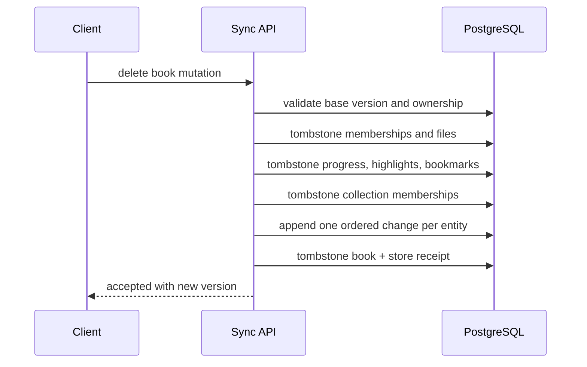

# Backend Architecture and Schema

## Deployment

Permanent credentials exist only in Railway variables. Clients receive
short-lived JWTs, opaque refresh tokens, and temporary signed object URLs.

## Database ER Diagram

`MAGIC_LINKS` is keyed by normalized email before a user necessarily exists,
so it intentionally has no user foreign key.

## Table Dictionary

| Table                    | Responsibility                                        |
| ------------------------ | ----------------------------------------------------- |
| `users`                  | Account identity and soft-deletion state              |
| `devices`                | Registered Android/Windows installations              |
| `magic_links`            | Hashed, expiring, single-use sign-in tokens           |
| `refresh_sessions`       | Rotating hashed refresh tokens and replay families    |
| `books`                  | User-owned bibliographic metadata                     |
| `library_memberships`    | Reading state such as active or archived              |
| `file_objects`           | Private object key, hash, size, type, and readiness   |
| `reading_positions`      | Current canonical location per user/book              |
| `highlights`             | Selection anchors, text context, color role, and note |
| `bookmarks`              | Stable saved reading locations                        |
| `collections`            | User-created organizational groups                    |
| `collection_memberships` | Book-to-collection relationships                      |
| `mutation_receipts`      | Original result for each user/operation UUID          |
| `change_log`             | Ordered per-user stream consumed by sync pull         |
| `entity_history`         | Recoverable prior payloads for same-entity conflicts  |

Most domain tables carry `version`, `created_at`, `updated_at`, and
`deleted_at`. Versions support optimistic sync; deletion timestamps represent
tombstones.

## Magic-Link Authentication

## Signed File Upload

The API authorizes and tracks the transfer without proxying the large file.

## Sync Push and Pull

## Book Deletion

An offline device later pulls every tombstone and removes local state instead
of recreating the book.

## Trust Boundaries

| Boundary          | Trusted information                                              |
| ----------------- | ---------------------------------------------------------------- |
| Client to API     | Nothing until schema, bearer token, user, and device checks pass |
| API to PostgreSQL | Parameterized typed queries and server-generated IDs             |
| API to bucket     | Server-owned credentials and object keys                         |
| Signed URL holder | Temporary permission only for one object/action                  |
| Railway variables | Database, JWT, cursor, Resend, and bucket secrets                |
| Logs              | Structured metadata with credentials redacted                    |

Clients are allowed to be offline and potentially modified by their owners.
The server therefore enforces ownership, versions, object keys, quotas, and
device identity independently of client behavior.
